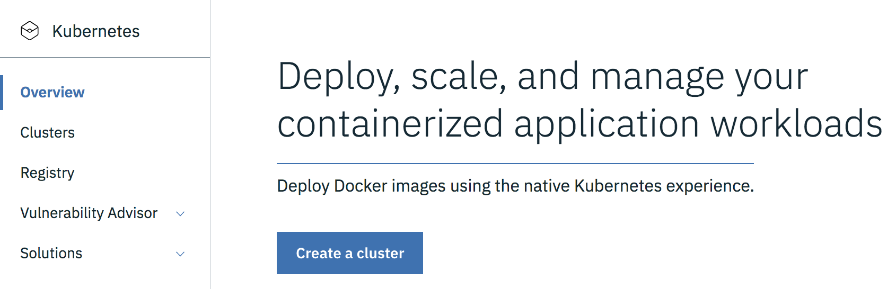
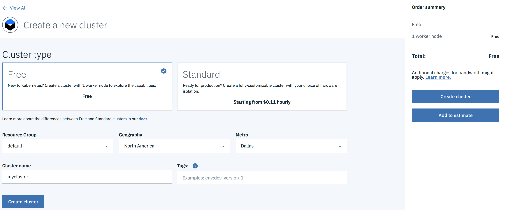
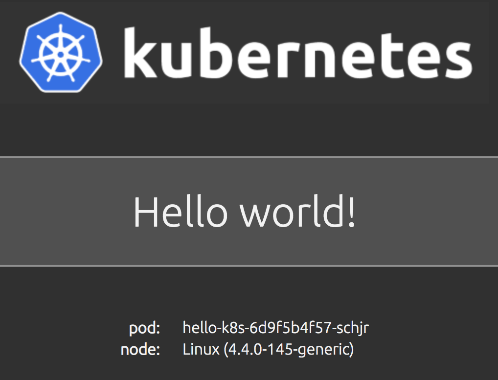

# Лабораторная работа

## Создание контейнерного приложения в IBM Cloud.

**Требования:**

 - Наличие аккаунта в IBM Cloud.
 - Установленные на локальной машине – Git, Docker, редактор кода.

## Этап 0. Установка необходимых инструментов

- Установка Git клиента: https://git-scm.com/book/ru/v2/Введение-Установка-Git
- Установка Docker движка: https://docs.docker.com/v17.12/docker-for-mac/install/
- Установка редактора Visual Studio Code: https://code.visualstudio.com 

## Этап 1. Создание кластера  Kubernetes в IBM Cloud.

В данной лабораторной работе будет использован демо-кластер Kubernetes, расположенный в IBM Cloud.

Для создания кластера необходимо выполнить следующие шаги:
- Перейти по адресу: https://cloud.ibm.com
- Войти  со своими учетными данными или создать новый аккаунт
- После успешного входа вы увидите следующий экран (рис.1).
- Необходимо раскрыть меню, нажав в левом верхнем углу на значок 

 
Рисунок 1.


- В раскрывшемся меню (рис. 2) необходимо выбрать опцию Kubernetes.


Рисунок 2.

- На открывшейся странице (рис.3) необходимо нажать на кнопку  Create Cluster

 
Рисунок 3.

- На странице создания кластера (рис. 4) необходимо убедиться, что выбран Cluster type – Free. Остальные значения надо оставить по-умолчанию и нажать кнопку Create Cluster.


Рисунок 4.


- Далее вы увидете страницу с описанием настроек для подключения (рис. 5), они понадобятся на следующих этапах.


Рисунок 5.

> На этом первый этап завершен


## Этап 2. Создание контейнерного приложения.

В рамках данного этапа будет создано простейшее Node.js приложение `Hello World`.  Данное приложение будет протестировано на локальном хосте.

Для создания и запуска приложения необходимо выполнить следующие шаги:

- Откройте терминальное окно
- Выполните следующую команду для того чтобы склонировать репозиторий с приложением: 
````
git clone https://github.com/albert-haliulov/2019-cloud-lab-for-sales.git
````

- Перейдите в папку с приложением
````
cd 2019-cloud-lab-for-sales
````

- В папке находится файл с именем `Dockerfile` следующего содержания:
````
FROM node:8.1.0-alpine

ARG IMAGE_CREATE_DATE
ARG IMAGE_VERSION
ARG IMAGE_SOURCE_REVISION

# Metadata as defined in OCI image spec annotations - https://github.com/opencontainers/image-spec/blob/master/annotations.md
LABEL org.opencontainers.image.title="Hello K8s." \
      org.opencontainers.image.description="Пример для показа установки контейнеризованного приложения в Kubernetes кластер. Приложение выводит приветственное сообщение, имя Pod-а и версию ОС хоста на которой запущено." \
      org.opencontainers.image.created=$IMAGE_CREATE_DATE \
      org.opencontainers.image.version=$IMAGE_VERSION \
      org.opencontainers.image.authors="Альберт Халиулов" \
      org.opencontainers.image.url="https://hub.docker.com/r/ahaliulov/hello-k8s" \
      org.opencontainers.image.documentation="https://github.com/albert-haliulov/2019-cloud-lab-for-sales/README.md" \
      org.opencontainers.image.vendor="" \
      org.opencontainers.image.licenses="" \
      org.opencontainers.image.source="https://github.com/albert-haliulov/2019-cloud-lab-for-sales.git" \
      org.opencontainers.image.revision=$IMAGE_SOURCE_REVISION 

# Create app directory
RUN mkdir -p /usr/src/app
WORKDIR /usr/src/app

# Install app dependencies
COPY app/package.json /usr/src/app/
RUN npm install

# Bundle app source
COPY app/ /usr/src/app

CMD [ "npm", "start" ]
````

- Используя файл `Dockerfile` запустите сборку Docker образа:

````
docker build --no-cache --build-arg IMAGE_VERSION="1.0.0" --build-arg IMAGE_CREATE_DATE="`date -u +"%Y-%m-%dT%H:%M:%SZ"`" --build-arg IMAGE_SOURCE_REVISION="`git rev-parse HEAD`" -f Dockerfile -t "hello-k8s:1.0.0" .
````

- Проверьте, что образ создался:

````
docker images
REPOSITORY                                            TAG                  IMAGE ID            CREATED             SIZE
hello-k8s                                             1.0.0                d24fdeaa0abe        7 minutes ago       80.4MB
````
- Запустите Docker контейнер с приложением:

````
docker run -d -p 8080:8080 --name hello-k8s hello-k8s:1.0.0
````

- Проверьте, что приложение запустилось:

````
docker ps
CONTAINER ID        IMAGE               COMMAND             CREATED             STATUS              PORTS                    NAMES
ecb82d346d6a        hello-k8s:1.0.0     "npm start"         4 seconds ago       Up 3 seconds        0.0.0.0:8080->8080/tcp   hello-k8s
````

- Приложение доступно по адресу http://localhost:8080


> На этом второй этап завершен

## Этап 3. Установка и настройка утилит командой строки для работы с вашим кластером.

Для работы с кластером потребуется инструменты командной строки – `IBM Cloud CLI` и `kubectl`.

- Установка инструментов командой строки:

````
curl -sL https://ibm.biz/idt-installer | bash
````

- Залогинтесь в IBM Cloud:

````
ibmcloud login -a https://cloud.ibm.com --sso
````

- Пока кластер создается, мы создадим новое пространство имен в Docker реестре:
````
ibmcloud cr namespace-add cloudlab2019
````

- Залогинтесь в созданном прострастве:
````
ibmcloud cr login
````

- Создайте метку для локального Docker образа приложения, который мы до этого создали:

````
docker tag hello-k8s:1.0.0 us.icr.io/cloudlab2019/hello-k8s:1.0.0
````

- Загрузите локальный Docker образ в Docker реестр, находящийся в IBM Cloud:

````
docker push us.icr.io/cloudlab2019/hello-k8s:1.0.0
````

- Проверьте, что образ загрузился:

````
ibmcloud cr image-list
Listing images...

REPOSITORY                         TAG     DIGEST         NAMESPACE      CREATED          SIZE    SECURITY STATUS   
us.icr.io/cloudlab2019/hello-k8s   1.0.0   19f4966e06bd   cloudlab2019   54 minutes ago   27 MB   3 Issues   

OK
````

**Только после того как ваш кластер будет создан, можно приступать к следующим шагам.**

- Настройте окружение командой строки для работы с кластером в том регионе в котором вы создали экземпляр сервиса Kubernetes:
````
ibmcloud ks region-set us-south
````
````
ibmcloud ks cluster-config mycluster
````

- Выполните команду, которая является результатом выполнения предыдущей команды. Ниже указан пример - он не обязательно будет совпадать с вашим.
````
export KUBECONFIG=/Users/$USER/.bluemix/plugins/container-service/clusters/mycluster/kube-config-hou02-mycluster.yml
````

- Проверьте что все настроено верно, выполнив команду выводящую список узлов кластера:

````
kubectl get nodes
NAME           STATUS    AGE       VERSION
10.47.79.241   Ready     10m       v1.12.7+IKS
````

> На этом третий этап завершен

## Этап 4. Установка и запуск приложения в IBM Cloud.

- В папке `kubernetes` находится файл с именем `hello-k8s.yaml` следующего содержания:

````
apiVersion: v1
kind: Service
metadata:
  name: hello-k8s
spec:
  type: NodePort
  ports:
  - port: 8080
    targetPort: 8080
    nodePort: 31000
  selector:
    app: hello-k8s
---
apiVersion: extensions/v1beta1
kind: Deployment
metadata:
  name: hello-k8s
spec:
  replicas: 1
  selector:
    matchLabels:
      app: hello-k8s
  template:
    metadata:
      labels:
        app: hello-k8s
    spec:
      containers:
      - name: hello-k8s
        image: ahaliulov/hello-k8s:1.0.0
        ports:
        - containerPort: 8080
````

- Используя файл `hello-k8s.yaml` запустите установку приложения на ваш кластер:

````
kubectl apply -f kubernetes/hello-k8s.yaml
service "hello-k8s" created
deployment "hello-k8s" created
````

- Проверьте, что установка приложения прошла успешно:

````
kubectl get deployments
NAME        DESIRED   CURRENT   UP-TO-DATE   AVAILABLE   AGE
hello-k8s   1         1         1            1           23s
````

````
kubectl get pods
NAME                         READY     STATUS    RESTARTS   AGE
hello-k8s-6d9f5b4f57-thwzg   1/1       Running   0          39s
````

````
kubectl get services
NAME         CLUSTER-IP     EXTERNAL-IP   PORT(S)          AGE
hello-k8s    172.21.56.17   <nodes>       8080:31000/TCP   59s
kubernetes   172.21.0.1     <none>        443/TCP          23h
````

- Чтобы открыть приложение, необходимо узнать публичный IP адрес вашего кластера. Для этого вернитесь в консоль IBM Cloud и откройте страницу созданного вами кластера. Публичный IP адрес указан на вкладке `Worker Nodes` как на картинке (рис.6).


Рисунок 6.

Приложение доступно по публичному IP адресу и соответствующему порту, например, в данном случае `demoapp` доступен по адресу http://184.172.229.113:31000. Вам нужно указать IP адрес своего кластера вместо <Public_IP> в адресе вызова приложения: http://<Public_IP>:31000



## Этап 5. Масштабирование приложения.

В случае если ваше приложение не справляется с нагрузкой или необходимо обеспечить непрерывную обработку запросов без простоя, обычно прибегают к масштабированию экземпляров приложения. С помощью функционала Kubernetes сделать это достаточно просто. 

- Еще раз убедитесь, что ваше приложение развернуто в единственном экземляре:
```
kubectl get deployments
NAME        DESIRED   CURRENT   UP-TO-DATE   AVAILABLE   AGE
hello-k8s   1         1         1            1           43m
```

- Вы можете масштабировать приложение указав кластеру сколько экземпляров вы хотите иметь:
```
kubectl scale deployment hello-k8s --replicas=4
deployment "hello-k8s" scaled
```

- Проверьте количество экземпляров приложения. Оно должно соответствовать указанному в `replicas` на предыдущем шаге:
```
kubectl get deployments
NAME        DESIRED   CURRENT   UP-TO-DATE   AVAILABLE   AGE
hello-k8s   4         4         4            4           51m
```

- Масштабирование возможно так же в обратную сторону. Уменьшим количество экземпляров приложения до одного:
```
kubectl scale deployment hello-k8s --replicas=1
deployment "hello-k8s" scaled
```

```
kubectl get deployments
NAME        DESIRED   CURRENT   UP-TO-DATE   AVAILABLE   AGE
hello-k8s   1         1         1            1           54m
```

## На этом пятый этап и вся лабораторная работа успешно завершены.

