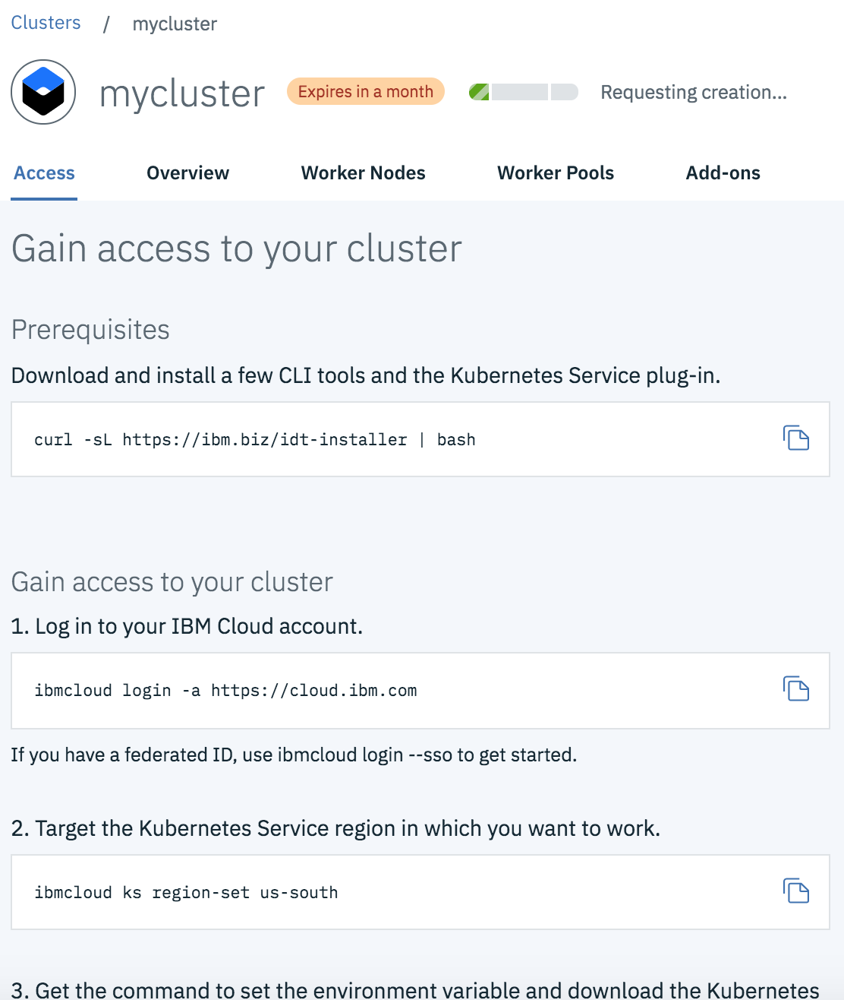

# Лабораторная работа

## Создание контейнерного приложения в IBM Cloud.

**Требования:**

 - Наличие аккаунта в IBM Cloud.

## Этап 1. Создание кластера  Kubernetes в IBM Cloud.

В данной лабораторной работе будет использован демо-кластер Kubernetes, расположенный в IBM Cloud.

Для создания кластера необходимо выполнить следующие шаги:
- Перейти по адресу: https://cloud.ibm.com
- Войти  со своими учетными данными или создать новый аккаунт
- После успешного входа вы увидите следующий экран (рис.1).
- Необходимо раскрыть меню, нажав в левом верхнем углу на значок 

 
Рисунок 1.


- В раскрывшемся меню (рис. 2) необходимо выбрать опцию Kubernetes.


Рисунок 2.

- На открывшейся странице (рис.3) необходимо нажать на кнопку  Create Cluster

 
Рисунок 3.

- На странице создания кластера (рис. 4) необходимо убедиться, что выбран Cluster type – Free. Остальные значения надо оставить по-умолчанию и нажать кнопку Create Cluster.


Рисунок 4.


- Далее вы увидете страницу с описанием настроек для подключения (рис. 5).


Рисунок 5.

> На этом первый этап завершен

## Этап 2. Установка и запуск приложения в IBM Cloud.

- В папке `kubernetes` находится файл с именем `hello-k8s.yaml` следующего содержания:

````
apiVersion: v1
kind: Service
metadata:
  name: hello-k8s
spec:
  type: NodePort
  ports:
  - port: 8080
    targetPort: 8080
    nodePort: 31000
  selector:
    app: hello-k8s
---
apiVersion: extensions/v1beta1
kind: Deployment
metadata:
  name: hello-k8s
spec:
  replicas: 1
  selector:
    matchLabels:
      app: hello-k8s
  template:
    metadata:
      labels:
        app: hello-k8s
    spec:
      containers:
      - name: hello-k8s
        image: ahaliulov/hello-k8s:1.0.0
        ports:
        - containerPort: 8080
````

- Используя файл `hello-k8s.yaml` запустите установку приложения на ваш кластер. Для этого необходимо:
1. Откройте консоль управления кластером нажав на кнопку `Kubernetes Dashboard` в правой части экрана 


2. Нажмите на кнопку `Create +` в верху справа экрана - для создания задачи по развертыванию приложения. 


3. В открывшуюся область необходимо скопировать содержимое файла `hello-k8s.yaml` и нажмите кнопку `Upload` для начала развертывания приложения.


- Чтобы убедиться, что процесс развертывания приложения произведен, можно перейти в раздел `Pods`, где отображаются все развернутые приложения в кластере. Ваше приложение будет называться `hello-k8s-####-####` и его `Status` должен иметь значение `Running`.


- Чтобы открыть приложение, необходимо узнать публичный IP адрес вашего кластера. Для этого вернитесь в консоль [IBM Cloud Kubernetes Cluster](https://cloud.ibm.com/kubernetes/clusters) и откройте страницу созданного вами кластера `mycluster`. Публичный IP адрес указан на вкладке `Worker Nodes` как на картинке (рис.6).


Рисунок 6.

Приложение доступно по публичному IP адресу и соответствующему порту, например, в данном случае по адресу http://173.193.99.78:31000. Вам нужно указать IP адрес своего кластера вместо <Public_IP> в адресе вызова приложения: http://<Public_IP>:31000


## Этап 3. Масштабирование приложения.

В случае если ваше приложение не справляется с нагрузкой или необходимо обеспечить непрерывную обработку запросов без простоя, обычно прибегают к масштабированию экземпляров приложения. С помощью функционала Kubernetes сделать это достаточно просто. 

- Перейдите в консоль управления кластером и выберете `Deployments`, далее в списке справа от вашего приложения кликните на `...` и выберете `Scale`:


- Далее укажите количество экземпляров приложения, которое вы хотите получить в результате и нажмите `OK`:


- Если вы перейдете обратно в `Pods`, вы увидете, что кластер создал столько экземпляров вашего приложения сколько вы указали:


- Для проверки того что запросы теперь обрабатываются всеми экземплярами приложения, можно открыть адрес приложения и обновить страницу несколько раз. На экране вы увидете ответы приложения из разных контейнеров (поле `pod`) т.е. от разных экземпляров данного приложения:


## На этом третий этап и вся лабораторная работа успешно завершены.

